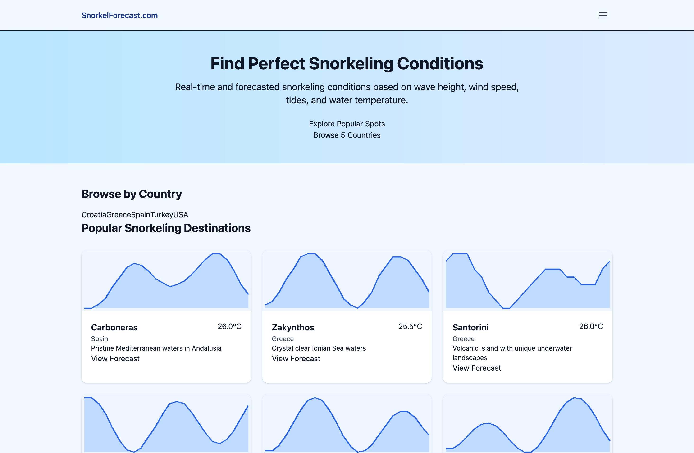

SnorkelForecast.com
====================

Forecasts for snorkeling conditions worldwide. Django backend, Tailwind UI, and a lightweight Docker deploy.

Live
- Website: https://snorkelforecast.com



Quick Start
- Install deps: `uv sync`
- Run dev server: `uv run python snorkelforecast/manage.py runserver`
- Tailwind (dev): `npm run tailwind:watch`

Project Layout
- Django project: `snorkelforecast/` (settings, manage.py)
- App: `conditions/` (views, urls, templates)
- Static: `snorkelforecast/static/` (Tailwind input/output, UI CSS); root `static/` for shared assets
- Templates: `conditions/templates/conditions/` (base + views)

Environment
- Copy `.env.example` to your runtime environment and set:
  - `SECRET_KEY`: required for production
  - `DEBUG`: `false` in production
  - `ALLOWED_HOSTS`: comma-separated hostnames
  - `CSRF_TRUSTED_ORIGINS`: comma-separated origins (https URLs)
  - `PRODUCTION`: set to enable `/persistent/db.sqlite3`
  - `CACHE_TTL`: seconds for view cache

Common Commands
- Install: `uv sync`
- Lint: `uv run ruff check .`
- Format: `uv run ruff format .`
- Migrate: `uv run python snorkelforecast/manage.py makemigrations && uv run python snorkelforecast/manage.py migrate`
- Test: `uv run python snorkelforecast/manage.py test`
- Run: `uv run python snorkelforecast/manage.py runserver`

Tailwind
- Dev: `npm run tailwind:watch`
- Build (CI/Docker): `npm run tailwind:build`
  - Dockerfile also downloads the Tailwind standalone binary and builds `snorkelforecast/static/css/output.css`.

Docker
- Build: `docker build -t snorkelforecast .`
- Run: `docker run -p 8000:8000 --env-file .env snorkelforecast`
- The container runs migrations, collects static, and starts Gunicorn via `startup.sh`.

Deployment
- GitHub Actions runs lint and tests on `master`/`main` pushes.

Production Deployment with Docker Compose
-----------------------------------------

1. **Environment Setup:**
   ```bash
   cp .env.example .env
   # Edit .env with your production values
   ```

2. **Required Environment Variables:**
   ```bash
   SECRET_KEY="your-production-secret-key-here"
   DEBUG="false"
   ALLOWED_HOSTS="yourdomain.com,www.yourdomain.com"
   CSRF_TRUSTED_ORIGINS="https://yourdomain.com,https://www.yourdomain.com"
   PRODUCTION="true"
   ```

3. **Deploy with Docker Compose:**
   ```bash
   docker-compose up -d
   ```

4. **Initial Data Migration:**
   ```bash
   docker-compose exec snorkelforecast uv run python snorkelforecast/manage.py migrate_popular_locations
   ```

5. **Health Check:**
   ```bash
   curl https://yourdomain.com/health/
   ```

New Features in Production
--------------------------

### Global Location Support
- **Lazy Loading**: Locations are discovered and cached on-demand
- **OpenStreetMap Integration**: Access to worldwide snorkeling locations
- **6-Hour Weather Caching**: Reduced API calls and rate limit handling
- **Smart Search**: Find locations by name, type, or region

### Production Optimizations
- **Persistent Database**: SQLite with persistent volume in production
- **Health Checks**: Docker health monitoring endpoint
- **Configurable Caching**: Environment-based cache TTL settings
- **Error Handling**: Graceful degradation with stale data fallbacks

### Monitoring
- Health check endpoint: `/health/`
- Database and cache status monitoring
- Automatic migration of popular locations
- Background scheduler for data updates
- Coolify (or similar) can watch the repo and deploy on push. Ensure env vars are set in the platform.

Security
- Do not commit real secrets. `SECRET_KEY` must be provided via environment in production.
- `DEBUG=false` and a strict `ALLOWED_HOSTS`/`CSRF_TRUSTED_ORIGINS` in production.
- WhiteNoise serves static files; run `collectstatic` in builds.
- `.gitignore` includes `.env`, `*.sqlite*`, and `staticfiles/`.
- If `db.sqlite3` is tracked locally, avoid using it for real data; prefer ephemeral dev data only.

Contributing
- Keep changes small and focused. Run Ruff before pushing.
- Write tests in `conditions/tests/` for new functionality.
- Conventional commits (e.g., `feat: ...`, `fix: ...`) encouraged.

License
- See repository license or contact maintainers if unspecified.
