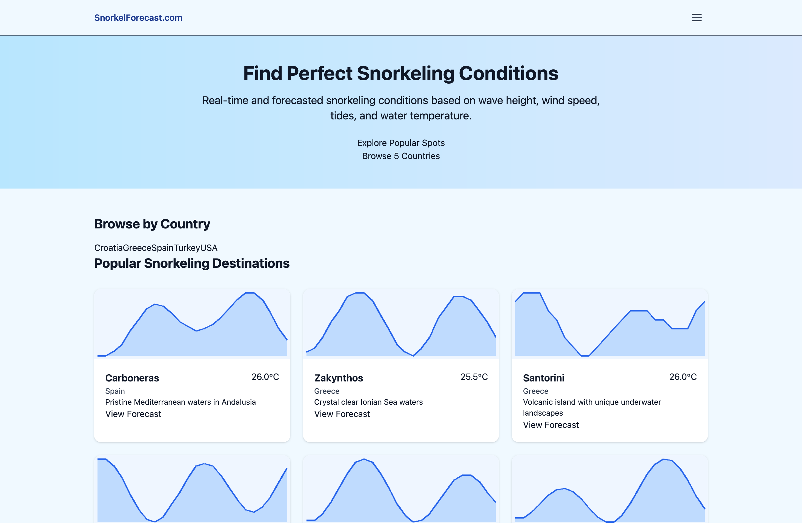

<div align="center">

# SnorkelForecast

> **Know before you go.** Hyperlocal snorkeling conditions — swell, wind, water temp, tide — for thousands of spots worldwide.

[](https://github.com/snorkelforecast/snorkelforecast/actions/workflows/ci.yml)
[](LICENSE)
[](pyproject.toml)
[](pyproject.toml)

🌊 [SnorkelForecast.com](https://snorkelforecast.com) · [Quick Start](#quick-start) · [Features](#features) · [Contributing](CONTRIBUTING.md)

</div>



## Why this exists

Checking swell, wind, and water temperature across a dozen tabs wastes the time you could be in the water. SnorkelForecast pulls everything onto one page — wave height, wind direction, tide, water temp, UV index — for any snorkeling spot on the planet. It's free, open-source, and self-hostable.

## Quick Start

```bash
# Install dependencies
uv sync

# Set up the database
uv run python snorkelforecast/manage.py migrate

# Populate with 500+ snorkeling spots
uv run python snorkelforecast/manage.py migrate_popular_locations

# Start the dev server
uv run python snorkelforecast/manage.py runserver

# (in another terminal) Watch Tailwind CSS
npm run tailwind:watch
```

Open http://localhost:8000 and search for a spot like **Honolua Bay, Maui**.

## Features

### Global Coverage
- **Thousands of locations** — automatically discovered from OpenStreetMap
- **Lazy-loaded forecasts** — spots appear on-demand, no manual entry needed
- **Tile-based OSM import** — process the globe at Zoom 8 for scalable spot discovery

### Forecast Data
| Metric | Source |
|---|---|
| Wave height & period | Open-Meteo Marine |
| Wind speed & direction | Open-Meteo Marine |
| Water temperature (SST) | Open-Meteo + ERA5 monthly |
| Tide predictions | Open-Meteo Tide API |
| UV index | Open-Meteo Air Quality |
| Weather (clouds, rain) | Open-Meteo Weather |

### Smart Caching
- 6-hour Django cache → ForecastHour DB → Open-Meteo fallback
- Background scheduler refreshes forecasts every 30 minutes
- Graceful degradation: stale data served when APIs are down

### SEO & Embedding
- Dedicated sea-temperature pages at `/<country>/<city>/sea-temperature/`
- Embeddable iframe widget at `/<country>/<city>/embed/sea-temperature/` with dofollow backlink
- Auto-generated sitemaps and IndexNow submission

## Try It Live

https://snorkelforecast.com

| Location | Example Page |
|---|---|
| 🇺🇸 Honolua Bay, Maui | [snorkelforecast.com/usa/honolua-bay/](https://snorkelforecast.com/usa/honolua-bay/) |
| 🇦🇺 Byron Bay, Australia | [snorkelforecast.com/australia/byron-bay/](https://snorkelforecast.com/australia/byron-bay/) |
| 🇪🇸 Carboneras, Spain | [snorkelforecast.com/spain/carboneras/](https://snorkelforecast.com/spain/carboneras/) |
| 🇵🇭 Coron, Philippines | [snorkelforecast.com/philippines/coron/](https://snorkelforecast.com/philippines/coron/) |

## Project Layout

```
snorkelforecast/
├── snorkelforecast/         # Django project (settings, wsgi)
│   └── manage.py
├── conditions/              # Main app (views, urls, templates)
├── static/                  # Tailwind output, JS, shared assets
├── staticfiles/             # Collected static (CI/build only)
├── screenshots/             # UI screenshots for docs
├── Dockerfile               # Production container
├── startup.sh               # Container entrypoint
├── tailwind.config.mjs      # Tailwind CSS v4 config
└── pyproject.toml           # Python dependencies (uv)
```

## Environment

Copy `.env.example` to your runtime environment:

| Variable | Required | Description |
|---|---|---|
| `SECRET_KEY` | Production | Django secret key |
| `DEBUG` | Production | Set `false` in production |
| `ALLOWED_HOSTS` | Production | Comma-separated hostnames |
| `CSRF_TRUSTED_ORIGINS` | Production | Comma-separated origins |
| `PRODUCTION` | No | Enables persistent `/db.sqlite3` |
| `CACHE_TTL` | No | View cache TTL in seconds |
| `ENABLE_OSM_IMPORT` | No | Enable OSM tile-based import |
| `USE_POSTGIS` | No | Use PostGIS instead of SQLite |

## Deployment

### Docker (production)

```bash
docker build -t snorkelforecast .
docker run -p 8000:8000 --env-file .env snorkelforecast
```

The container runs migrations, populates locations, collects static files, and starts Gunicorn via `startup.sh`.

### Docker Compose

```bash
docker-compose up -d
docker-compose exec snorkelforecast uv run python snorkelforecast/manage.py migrate_popular_locations
```

### CI/CD

GitHub Actions runs lint + tests on every push. Production deploys via Coolify (Docker build on push). A backstop webhook in `.github/workflows/ci.yml` pings Coolify after tests pass on `main`.

### OSM Import

Automatically discover snorkeling spots from OpenStreetMap:

```bash
# Create tile queue for a region
uv run python snorkelforecast/manage.py import_osm_tiles --create-tiles --zoom 8 --country-bbox "35,-10,45,5"

# Import in batches
uv run python snorkelforecast/manage.py import_osm_tiles --batch-size 10
```

Health check: `https://yourdomain.com/health/`

## Commands

| Command | What it does |
|---|---|
| `uv sync` | Install Python deps |
| `uv run ruff check .` | Lint |
| `uv run ruff format .` | Format |
| `uv run python snorkelforecast/manage.py test` | Run tests |
| `uv run python snorkelforecast/manage.py makemigrations && uv run python snorkelforecast/manage.py migrate` | DB migrations |
| `npm run tailwind:watch` | Tailwind dev (watch) |
| `npm run tailwind:build` | Tailwind production build |

## Security

- Never commit real secrets. Provide `SECRET_KEY` via environment in production.
- Set `DEBUG=false` and configure `ALLOWED_HOSTS`/`CSRF_TRUSTED_ORIGINS` in production.
- WhiteNoise serves static files; run `collectstatic` in builds.
- `.gitignore` excludes `.env`, `*.sqlite*`, and `staticfiles/`.

## Contributing

See [CONTRIBUTING.md](CONTRIBUTING.md).

## License

MIT © SnorkelForecast
